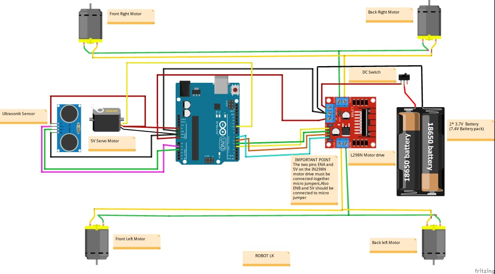
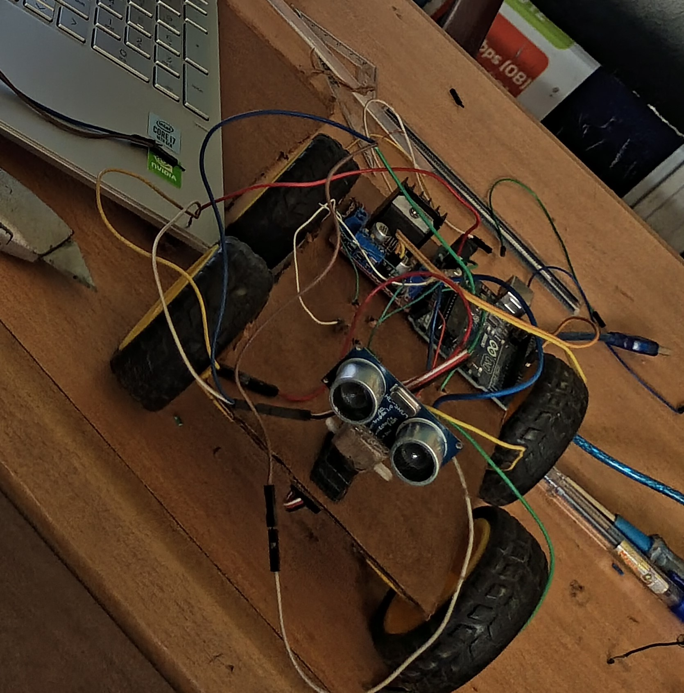

# obstacle-avoidance-WMR-482
Obstacle avoidance wheeled mobile robot(Course 482)
_____

**Introduction**
An obstacle avoidance wheeled mobile robot is a type of autonomous or semi-autonomous robot that is designed to navigate through an environment while avoiding obstacles in its path. These robots are commonly used in various applications, including industrial automation, warehouse logistics, home cleaning robots, and even in educational settings.

Here's a basic description of a wheeled mobile robot's components and its method of operation using the equipment you mentioned:

Components:
1. **Wheeled Chassis:** The robot has wheels or tracks that allow it to move across a surface.

2. **Motors:** It typically includes multiple motors (you mentioned 4 motors), which control the movement of the wheels or tracks. These motors can be DC motors or stepper motors, depending on the design.

3. **Motor Driver:** The motor driver is responsible for controlling the motors. It receives commands from the robot's controller and regulates the power supplied to the motors, enabling them to move forward, backward, turn, etc.

4. **Ultrasonic Sensor:** The ultrasonic sensor is used for obstacle detection. It emits ultrasonic waves and measures the time it takes for the waves to bounce back after hitting an obstacle. This information helps the robot detect the distance to objects in its vicinity.

5. **Servo Motor:** The servo motor is often used to mount the ultrasonic sensor. A servo motor provides precise control of the sensor's angle or orientation, allowing the robot to scan its surroundings.

Method of Operation:
1. **Sensing:** The robot starts by using the ultrasonic sensor. It sends out an ultrasonic pulse and measures the time it takes for the pulse to return. This time delay is used to calculate the distance to any obstacle in front of the robot.

2. **Obstacle Detection:** Based on the data from the ultrasonic sensor, the robot's control software determines whether there are obstacles in its path. If an obstacle is detected within a certain range, the robot proceeds to obstacle avoidance.

3. **Obstacle Avoidance:** The robot's software calculates a safe path to avoid the detected obstacle. This path planning can be quite simple, like turning left or right to avoid the obstacle, or it can be more sophisticated, involving algorithms such as A* or Dijkstra's algorithm for finding the optimal path.

4. **Motor Control:** Once the path is determined, the motor driver is used to control the four motors. It adjusts the speed and direction of the wheels accordingly to follow the safe path and avoid the obstacle.

5. **Feedback Loop:** The robot continuously updates its sensor data and repeats the process, making real-time adjustments to its path as it encounters new obstacles or changes in the environment.

Overall, the ultrasonic sensor and servo motor help the robot perceive its surroundings and adapt its movements to avoid collisions, making it a basic obstacle avoidance wheeled mobile robot. More advanced robots may use additional sensors (e.g., cameras, lidar, or infrared sensors) and complex algorithms for navigation and obstacle avoidance.

### Circuit Diagram

The circuit was developed using Fritzing

### Finished project

Below is a picture taken of the robot

